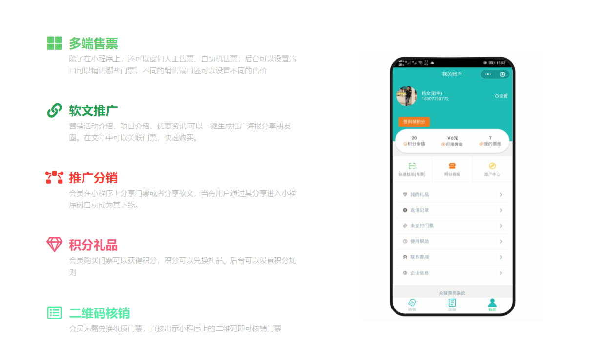

# 智慧票务系统说明介绍


**提示:** 本文档包含了[众链网络](https://www.zl771.cn)票务系统的全部使用说明。您可根据实际需求选择性阅读相应章节。由于软件系统处在持续更新升级中，文档内容可能存在滞后，若文档描述与软件实际功能不符，请以软件界面为准。我们会尽快完成文档的同步更新。


## 系统概述

众链票务系统是由[广西众链网络科技有限公司](https.zl771.cn)自主研发，一套面向景区、游乐场、乡村旅游生态园、展会等多种业态的通用票务管理系统。本系统致力于实现线上、线下全流程业务的数据融通，提供覆盖售票、检票、营销、管理等场景的一体化解决方案。

## 新功能亮点


**功能更新:** 

*   **门票规则支持Cron表达式:** 为满足复杂的业务需求，新版本现已支持通过Cron表达式对门票使用规则进行更加灵活的设置。详情参见[Cron设定](ticket-settings/cron-piao.md)。
*   **门票预约功能:** 系统已正式上线门票预约功能，便于对客流进行前置管理与控制。

欢迎登录我们的演示系统进行实地功能体验。https://ticket.anjian99.com/


## 核心功能

*   **全面的票务管理:** 系统以售票和检票为核心，通过参数组合，可灵活配置市场上各类主流门票，如年票、套票、团体票、计次票等。
*   **一体化业务集成:** 除核心票务功能外，系统还集成了停车收费、酒店住宿、收银点单、渠道分销、一卡通消费等多种增值服务模块，以满足综合性运营需求。

## 系统组成

系统由以下部分构成，以满足不同场景下的操作需求：

*   后台管理端
*   小程序客户端
*   自助售票机 (Windows)
*   手持售票机 (Android)
*   手持检票机 (Android)
*   电脑售票客户端 (Windows/Android)

## 技术栈

*   **后端服务:** 基于WTM框架，采用 Asp.net Core + EFCore + Redis + Mysql 技术栈。
*   **小程序端:** 采用Taro框架进行开发，支持一键编译生成适配多平台的小程序。
*   **自助机端:** 采用Electron与Vue技术栈，构建Windows桌面应用。
*   **手持机及电脑端:** 采用Flutter框架，实现Android、Windows、Web平台的多端代码复用。

更多信息请访问我们的官方文档网站：<https://ticket-book.zl771.cn/>

我们提供一整套完整的软硬件解决方案，并拥有专业的实施团队，可确保项目在一周内快速上线运营。

## 关于广西众链网络

>[广西众链网络科技有限公司](https://www.zl771.cn)成立以来一直专注于软件定制开发、网站建设、网站设计、小程序开发、APP开发等高端项目的制作，在JAVA、.NET、Android、IOS、小程序开发上均有成熟团队，可根据客户的需求，量身定制一系列符合客户实际应用的软件。
