# 后台操作说明书


**tips:** [众链票务系统](https://www.zl771.cn)各个门票销售端口的管理、票据的设置、支付、报表、参数等其他功能的管理都由一个统一的后台管理。不同的角色登录到后台管理系统看到的功能也不一样


> 查看最新的演示版本请 访问[https://ticket.anjian99.com](https://ticket.anjian99.com)

## 登录众链票务系统

打开后台网址，输入用户名密码登录，默认用户名admin 密码000000

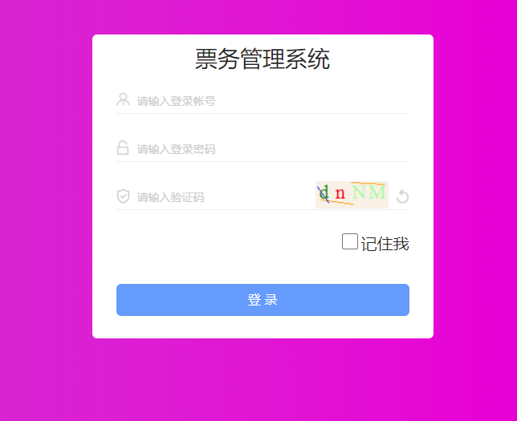

### 后台首页

首页上部分提供各个常用功能的快捷入库，以及当日关键数据指标，更多的详细报表可以在报表明细中查看。

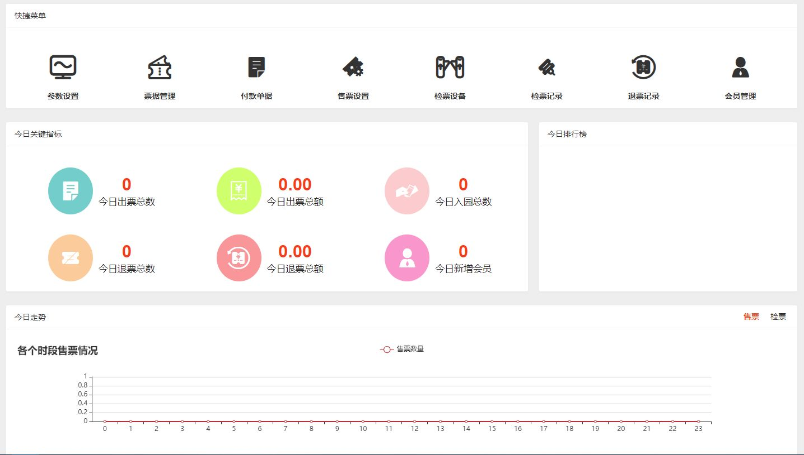

### 系统管理

系统管理主要是对后台用户/角色的管理、权限设置、导航菜单管理以及系统日志记录

#### 用户管理

这里的用户指的是能登录后台的用户以及各个售票端的售票员账号。在用户管理界面上，我们可以新增/编辑用户，修改用户的登录密码，启用停用用户账号以及删除用户（删除功能慎用，如不想让用户登录系统禁用即可）

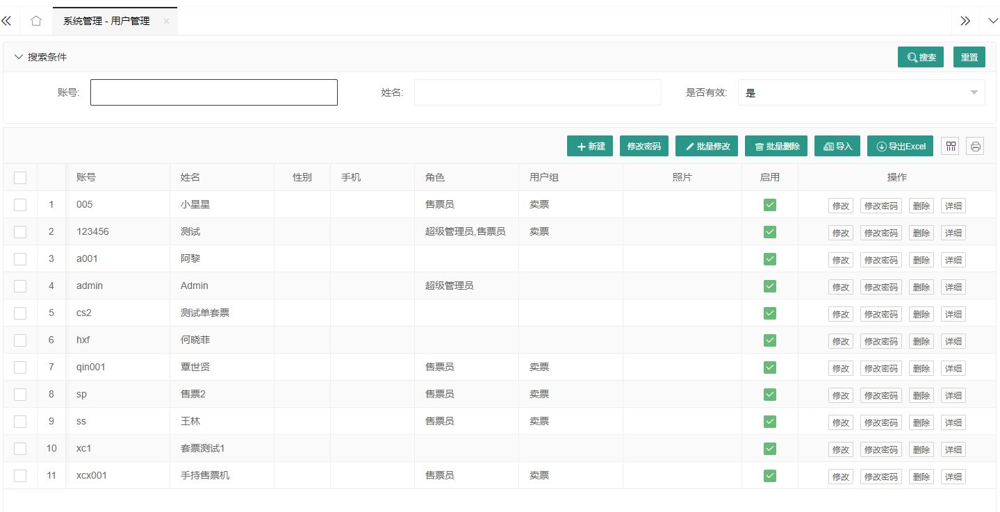

#### 角色管理

在票务系统中，对各个用户账号的权限控制通过角色管理来实现，一个用户可以拥有多个角色身份，同时一个角色也可以包含多个用户，通过对角色页面权限的设置可以控制用户所拥有的系统功能。

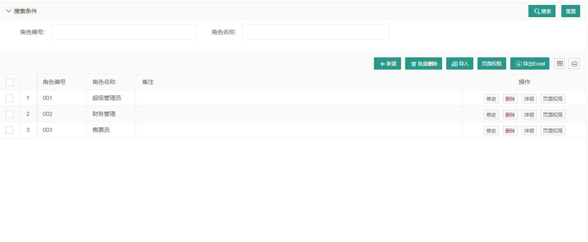

#### 菜单管理

菜单管理是对后台导航菜单的设置编排，默认的我们已经设置好所有的菜单，您也可以根据自己的实际情况来调整菜单，调整菜单之后需要点“刷新菜单”重新登录后才生效。

#### 日志

日志系统会记录后台操作、API接口操作记录，系统有异常时会记录详细的错误信息下来，供运维排查参考。通过配置文件设置可以设置日志的记录级别。正常情况下，系统不会主动删除任何日志记录，如果觉得日志过多影响系统响应可以手动删除。

### 基础设置

基础设置里主要是票务系统的一些参数设置，比如支付机构参数设置、自助机参数设置、小程序参数设置、公众号参数设置、OTA参数设置和其他参数设置。票据分类和分销渠道也放到基础设置中了，您可以在菜单管理中根据自己的喜好来重新编排菜单。

#### 参数设置

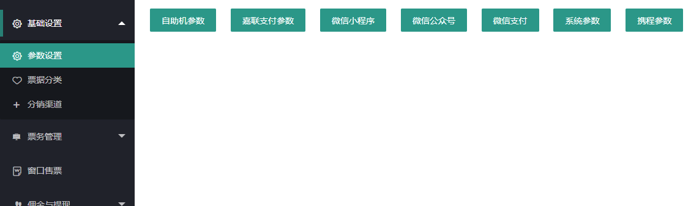

#### 票据分类

虽然系统支持多级分类，但是为了考虑售票机上操作的便利，建议只做一级分类。

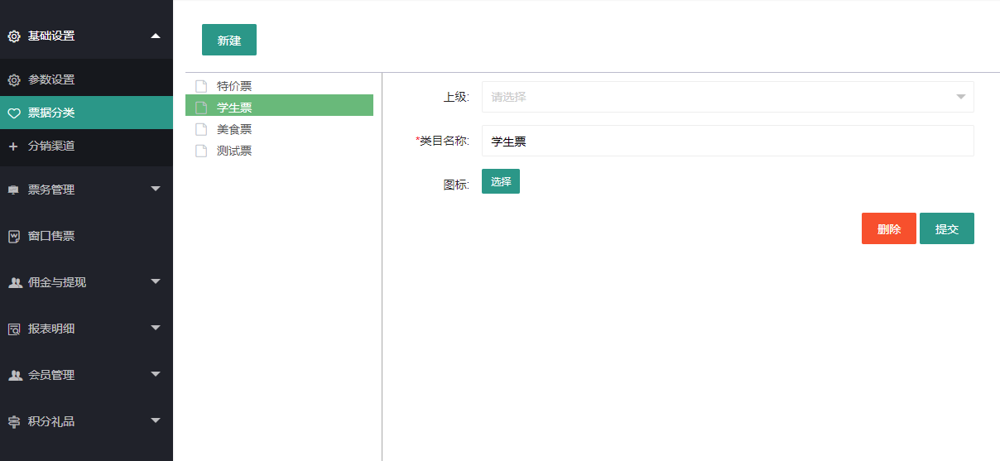

#### 分销渠道

这里的分销渠道不涉及到任何结算、佣金，只是方便统计地推人员的推广情况，如要论功行赏可以在分销统计报表中查看统计数据。

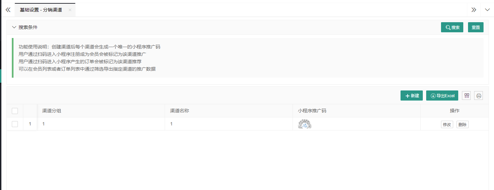

### 票务管理

票务管理是整个票务系统的核心部分，门票类型的设置、售票/检票权限的设置都是在这里管理

#### 票据管理

各种门票类型（年票、套票、次票等），门票限售、推广佣金、积分奖励、使用日期 通过参数组合可以生成不同类型的门票。由于篇幅有限，我们将在另外的篇幅中详细介绍如果通过参数组合来生成各种常见的门票类型。

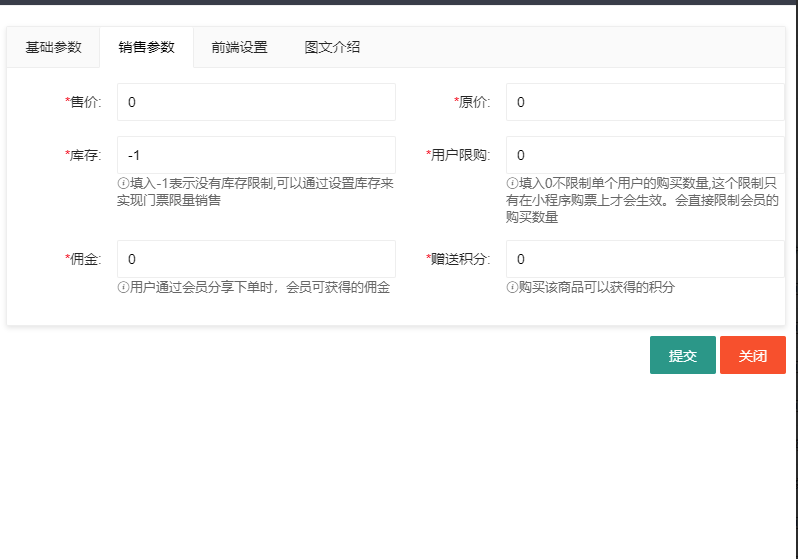

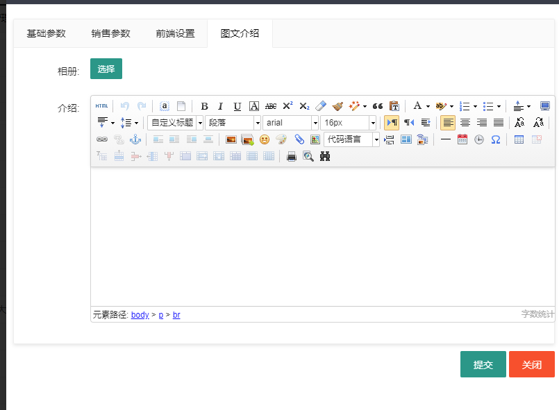

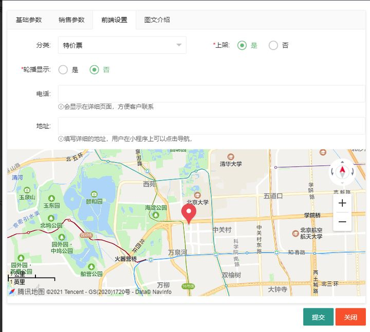

#### 售票设置

可用设置各个售票员\售票渠道的售票权限，在售票界面上售票人员只能看到自己有权销售的门票。通过售票权限的设置，我们可以很轻松地实现不同渠道售不同的门票。通过数据权限的设置，售票人员登录到后台系统只能看到自己的销售情况，具体数据权限设置参见[数据权限设置](others/dataprivilege.md)

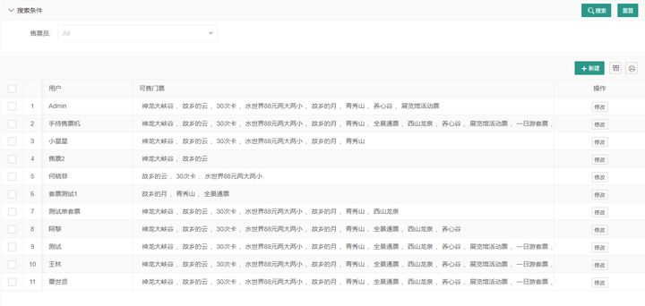

#### 检票设备

在我们的系统中，闸机、手持检票机、检票app 统称为检票设备。检票设备有进出两种通行方向，有些场合进出都需要刷卡扫码的，那我们可以通过分别设置两个检票设备（一进一出）来实现。检票设备同样也有权限设置，只有勾选了门票该设备才能检对应的票据。当检票设备不再使用的时候，您可以删除设备，通常，为了保证系统数据都完整性，我们不建议您删除设备，而是建议您将设备禁用。

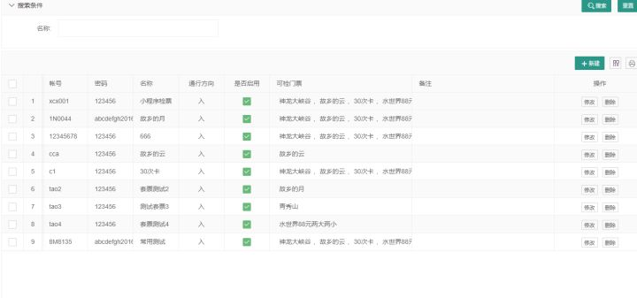

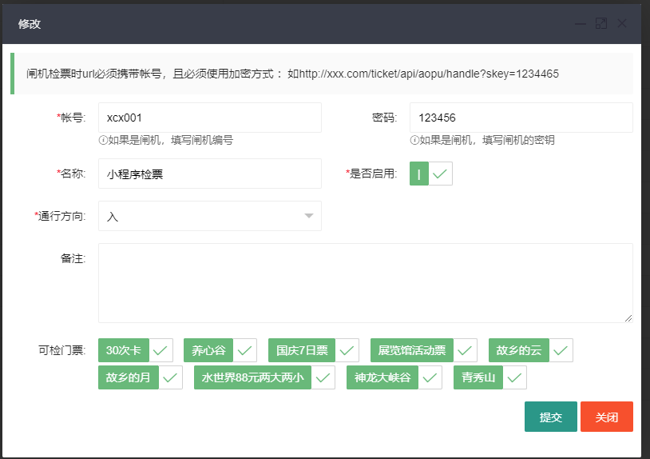

#### 退票管理

在这里可以发起退款退票，金额将原路退回。如果是客人已经使用门票，但是由于某些因素导致客人不能继续体验门票对应的服务，那可以通过强制退票来退款给客人。值得注意的是，每个门票只能退一次，所以退款金额一定要跟客户确认好之后再发起退款。

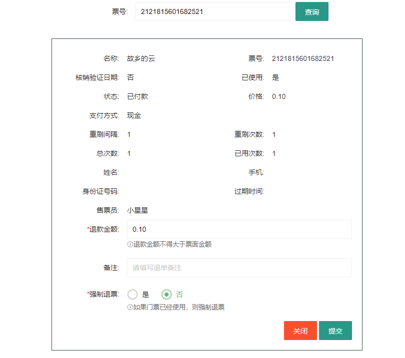

## 佣金与提现

该功能对应的是小程序上的分销推广，会员用户通过分享小程序给亲朋好友，好友在小程序上购买门票即可得到响应的佣金。会员得到佣金后可以在小程序上发起提现申请，后台工作人员审核通过之后再给会员打款转账。值得一提的是，好友购买门票后佣金并不是立即到账，需要等门票核销使用后才会到账

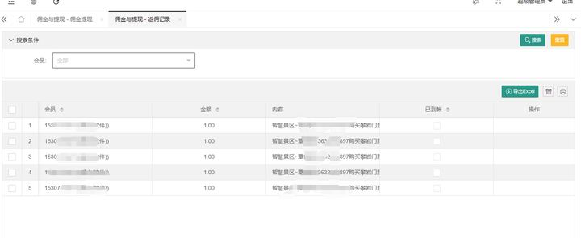

## 报表明细

这里是系统的各种报表、订单明细和付款单据

#### 付款单据

付款单据指的是第三方支付机构的交易记录，包含门票订单和门票退款单，这里的数据可以作为与第三方支付机构的对账单。系统有交易异常检测机制，支付超时或付款异常的订单系统会自动冲正。

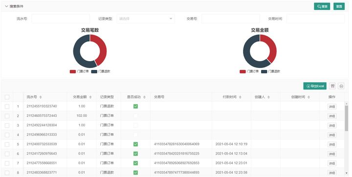

#### 检票记录

记录门票的使用情况

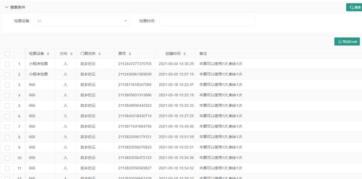

#### 票据订单

即是门票销售明细，特别说明的是“导出密码”功能是与小程序上的“密码激活”配合使用。平台可以通过公众号发放密码给会员，会员再通过密码激活功能激活门票使用。

#### 分销统计

线下地堆分销人员的订单统计，这里的报表可作为提成分润依据

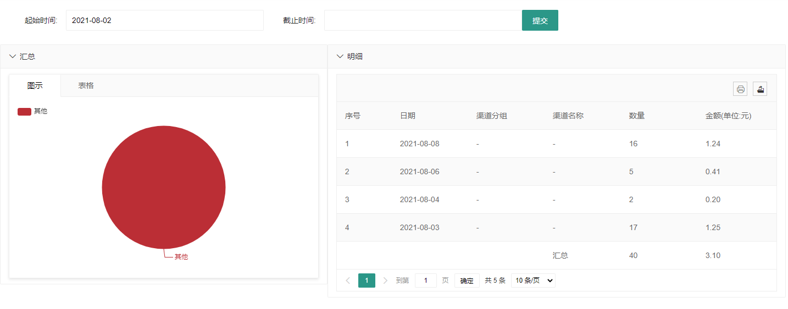

#### 退票记录

系统中退票退款的金额是原路返回的，这里只做记录，第三方支付的是否退款成功需要在付款单据中查看

#### 门票统计

以图表的形式按日统计各个门票的销售情况，可以按时间范围筛选，导出也很方便

#### 渠道统计

与分销统计不同，这里是按销售人员(渠道)来统计数据的

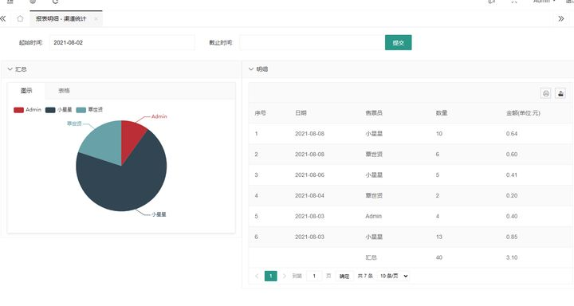

### 积分礼品

会员在小程序上购买门票或者签到都可以得到积分，得到积分后可以在积分商城里兑换礼品，兑换礼品后需要后台核销。

#### 积分记录

记录会员每次会员积分变动情况

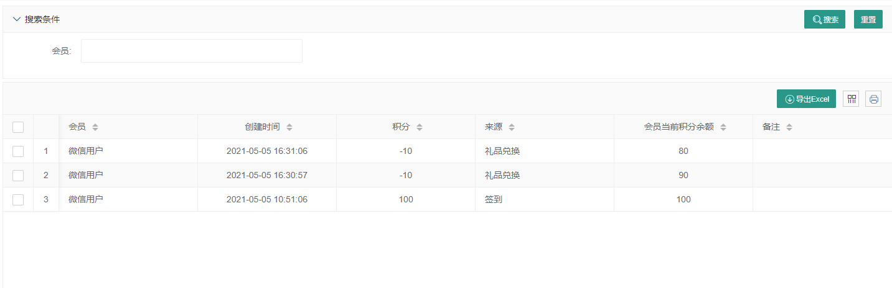

#### 礼品管理

礼品的增删改查，添加的礼品会在小程序上显示（只有勾上可用才会显示），当会员有足够的积分时就可以兑换礼品

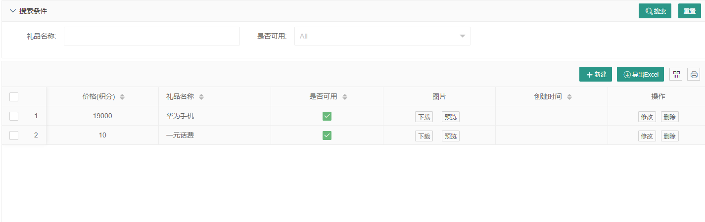

#### 礼品兑换

用户在小程序上发起兑换，后台审核核销后发放礼品

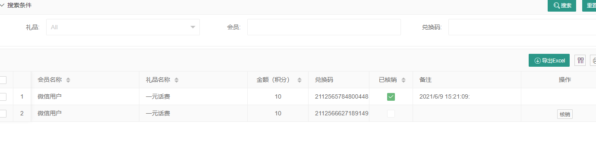

## 资讯管理

可以发布一些出行攻略、活动介绍或者推广软文，这些文章会在小程序、自助机上显示

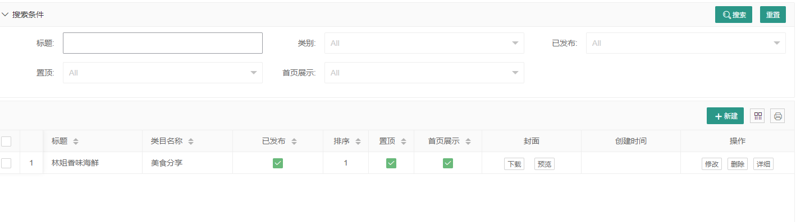
