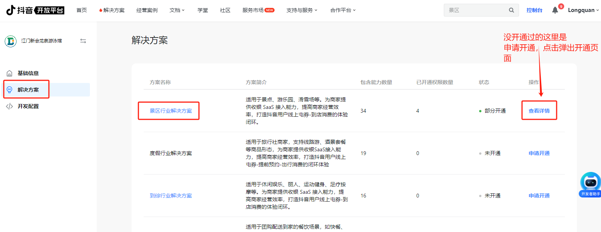
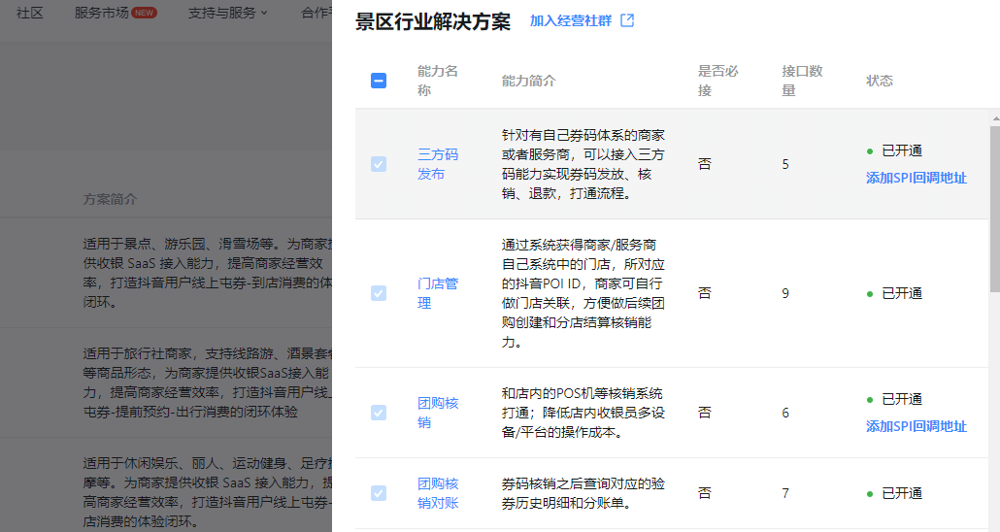
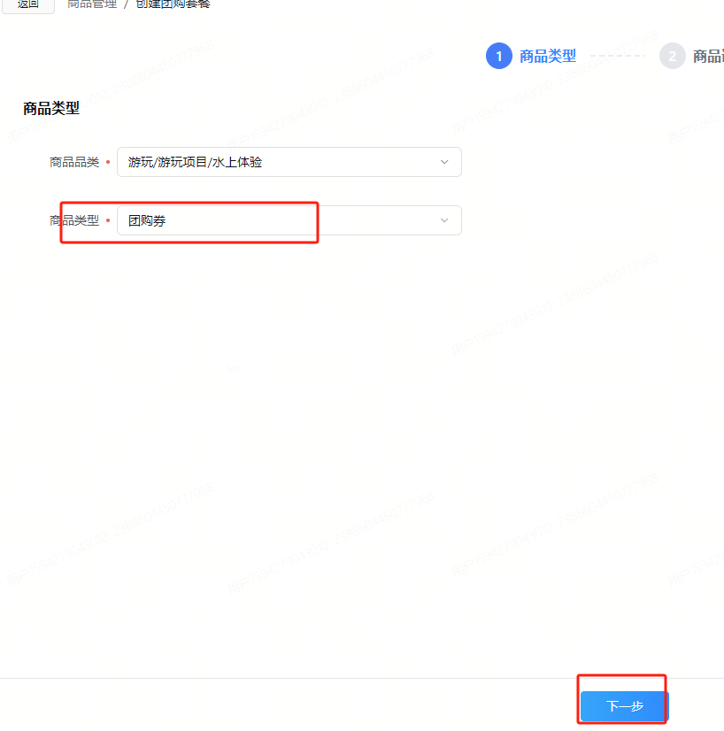
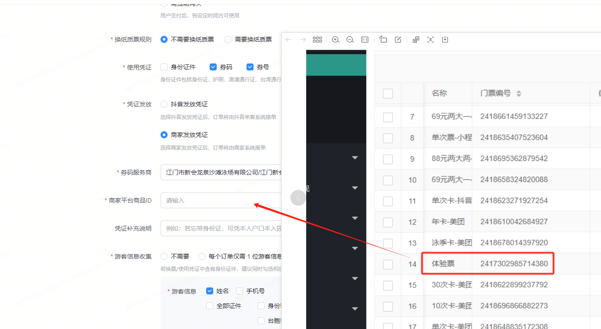
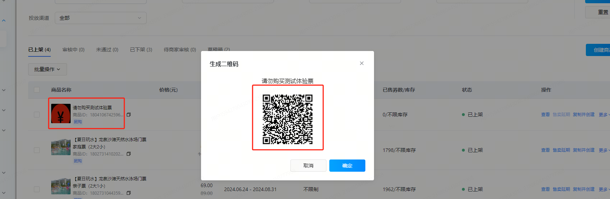
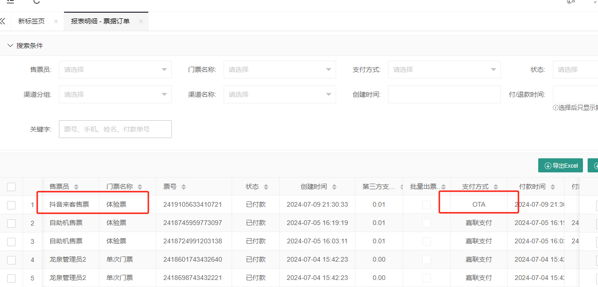

# 抖音来客对接

## 1. 抖音来客对接流程

1. 抖音来客注册，抖音开放平台注册
2. 登录抖音开放平台开通生活服务应用
  

3. 点击应用图标，进入应用，开通解决方案
  
4. 勾选开通如下几个（主要是三方码），提交后等待审核
  
5. 设置三方码回调地址
  
抖音请求三方系统预下单 https://系统域名/ticket/api/dylife/Create
抖音请求三方系统发码（同步）https://系统域名/ticket/api/dylife/Pay
【景区订单状态查询】获取订单核销状态https://系统域名/ticket/api/dylife/query
【抖音请求三方系统退款审核】，允许同步返回审核结果https://系统域名/ticket/api/dylife/Refund
抖音向三方系统同步退款信息https://系统域名/ticket/api/dylife/RefundResult
6. 配置票务系统后台，按实际情况填写表单，【接口验收用例】部分是为了快速通过一些接口的上线测试而配置的，一个用例一个门票不可重复
  

## 抖音来客设置

1. 绑定开放平台账号，绑定好之后应用列表中就可以看到应用了
  
2. 在商品发布中发布商品
  
3. 商品类型选择团购券，点击下一步
  
4. 商品的销售属性需要与票务系统中填写的一致，凭证发放选择商家发放凭证，券码服务商选择开通的应用，商家平台商品ID填写票务系统中的编码（注意票务系统中的门票要在销售设置中勾上抖音来客售票的账号）
  
5. 填好信息后发布，审核通过后即可用抖音扫码购买（请确保抖音上）
  
6. 在抖音上购买门票
  
  
7. 在票务系统上可以看到该门票了

8. 在景区闸机（需要在系统的检票设置中设置闸机允许核销的门票）上直接扫抖音上的二维码就可以核销，核销后系统会自动同步核销结果到抖音
