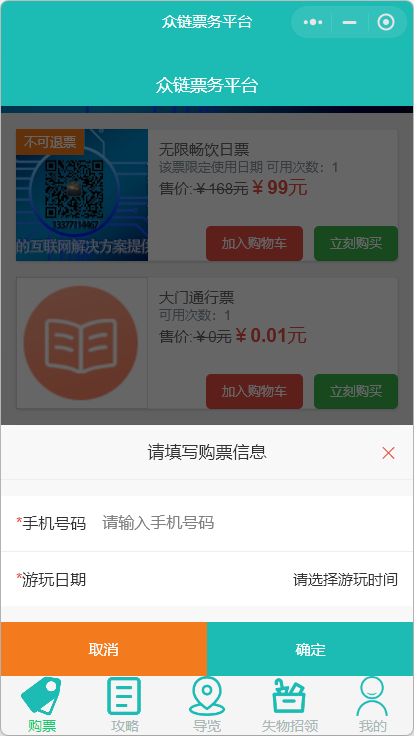
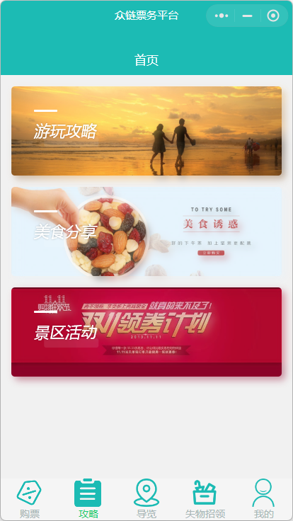
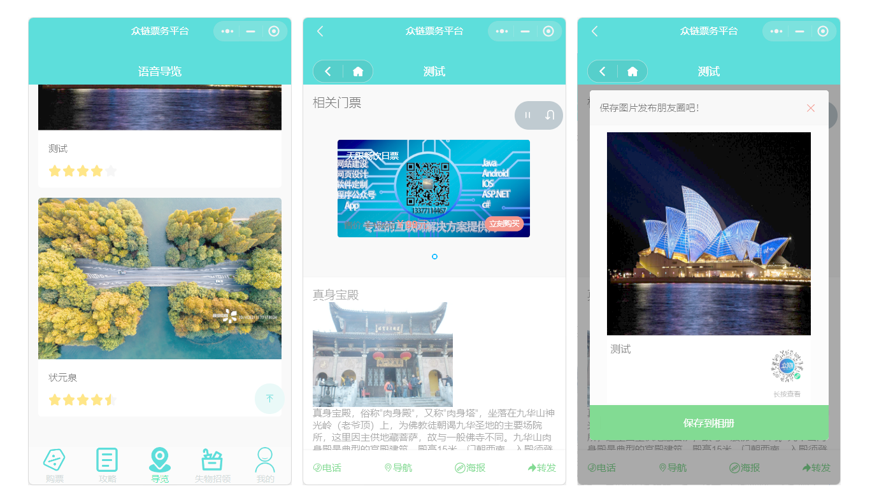
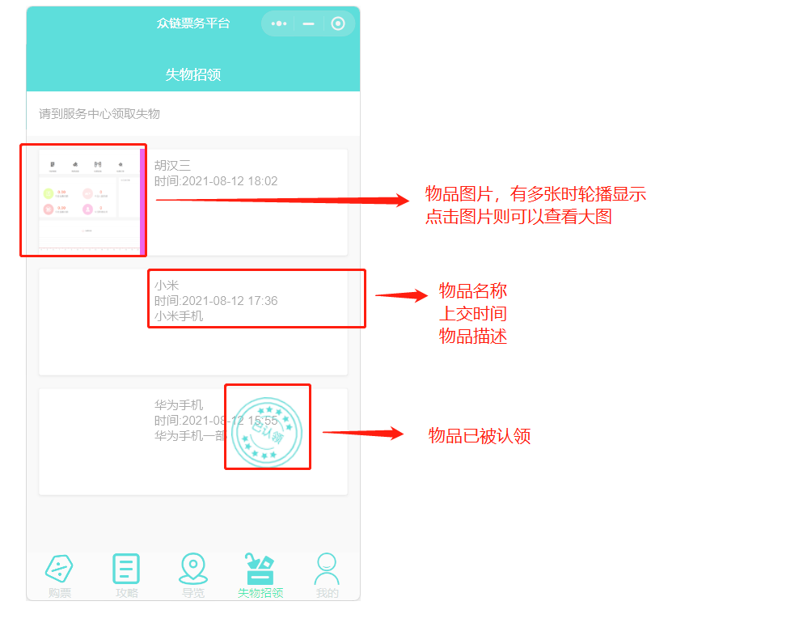
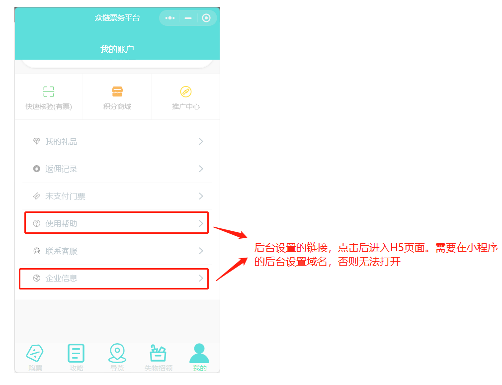
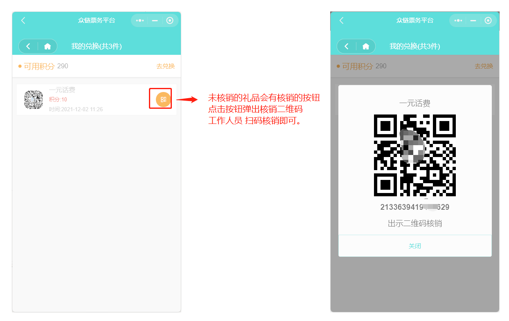
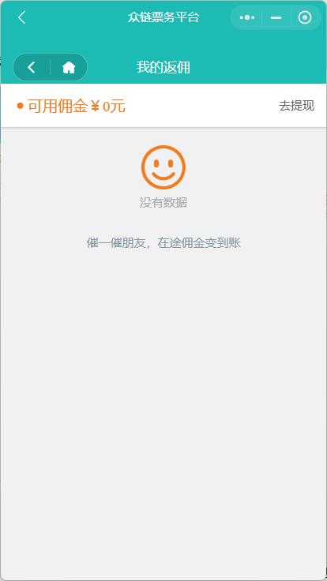

# 小程序售票


 [众链票务系统](https://www.zl771.cn)小程序基于taro3 开发，可以编译成微信小程序、抖音/头条小程序、百度小程序、QQ小程序、支付宝小程序。目前标准版的只提供微信小程序一个版本。


> **注意：  需要在后台配置小程序的售票权限小程序才可以售票，在使用小程序之前，请先后台配置好，否则会报错！**
由于文档编写时使用的是电脑版小程序截图，小程序页眉显得略高，在实际手机上页面会更加美观。
小程序的所有api都有响应的文档，若是您觉得小程序界面与自身品牌色调不吻合可以重写前端页面。

## 首页

### 整体介绍

  首页设计的比较简洁专注，上半部分重点推荐的门票，以轮播图的形式展现出来。门票有立刻有卖和加入购物车两个按钮，可以快速购买门票。点击门票图片则可以进入门票的详细介绍页面
  

### 加入购物车

  点击加入购物车时，如果门票需要填写游玩日期或者姓名电话之类的，会在底部弹出提示框，按提示输入好信息之后点击确认就可以加入购物车。

  **由于门票通常为一票一码，所以在加入购物车的时候是没有数量填写的选项，这与一般的网络购物略有不同。如果想要购买多张门票，只需点击多次加入购物车即可** *在定制版中加入购物车时可以填写数量*

  

### 立刻购买

  点击立刻购买后，如果门票需要填写游玩日期或者姓名电话之类的，会在底部弹出提示框，按提示输入好信息之后点击确认回直接进入到提交订单付款的页面。
  

### 门票详情页面

## 攻略

  攻略对应的是后台的资讯管理，攻略的首页展示的是文章的分类，点击分类图片可以进入查看各个类目下的文章资讯

  

+ 分类的目录索引页面
    在分类的索引页面，上部是置顶的文章轮播，下方则是文章列表，点击则可以进入文章的详细页面
    

+ 文章详情页
    文章详情页的首屏是封面，这个封面图片是自适应的，生成海报或者转发也都是展示这个封面。底部有点赞、留言、海报和转发的操作按钮。在后台发布文章的时候选择关联门票后，在文章的页面里会有快速购买门票的入口，当会员用户浏览该文章时，可以快速跳转到购票页面。
    

## 导览

  顾名思义，导览可以通过语音、图文视频的形式介绍景区景点特色，景点的典故，用户进入景点的导览页面后会自动播放语音解说介绍。与攻略文章一样，语音导览的景点也可以关联门票，用户可以快速进入门票购买页面；与攻略文章不一样的是，底部的菜单为电话、导航、海报和转发，用户点击电话可以呼出手机的拨号页面，快速与景区联系，点击导航则可以调出地图导航到景区。

  

## 失物招领

  用户在游玩的时候有丢失物品可以到这里来查看是否已经交到服务中心。
  

## 我的-*会员中心*

  小程序的很多功能入口都是在“我的”页面，下面我们就来一一讲解。

### 我的首页

  会员中心的首页主要是账号概览和各个功能的入口
  

### 我的票据

### 积分商城

用户在购买门票、或者签到都可以获得积分（**需要在后台设置**）,得到积分后可以在积分商城兑换礼品


**提示：** 在定制版中，积分兑换可支持邮寄

### 我的礼品

显示用户兑换过的礼品，用户到服务台凭二维码核销领取礼品

### 推广中心

  会员在转发小程序或者分享海报给朋友，朋友购买门票后会员可以得到返利。在推广中心可以查看自己的推广情况。

  

### 返佣记录

  推广成为下线的会员购买带有佣金的门票后就可以获得返佣，返佣在门票核销之后才会到账可以提现。提现后需要后台审核发放佣金。

  
  
  **提示：** 并不是所有的门票都有佣金，需要在门票设置中填写佣金才会有！
  

### 未支付门票

在未支付门票列表中，用户可以选择多张门票然后合拼支付，系统会定时清理过期未支付的门票

### 联系客服

点击可以打开微信小程序客服对话页面，在门票的详情页面也有联系客服的按钮

### 使用帮助

后台设置的一个超链接

### 企业信息

后台设置的一个超链接
