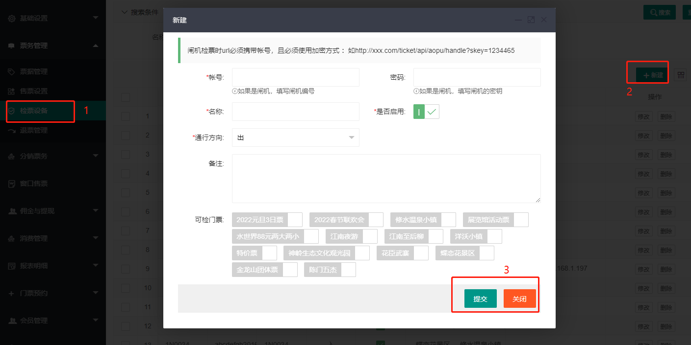
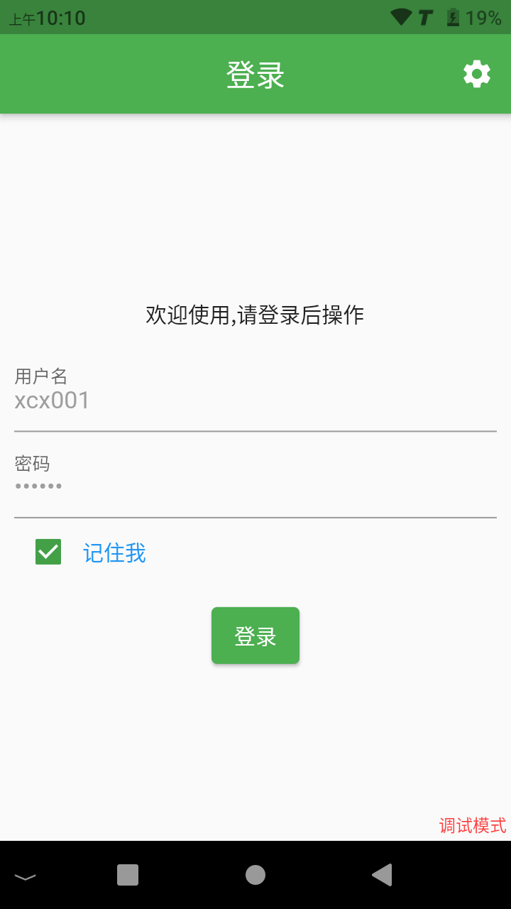
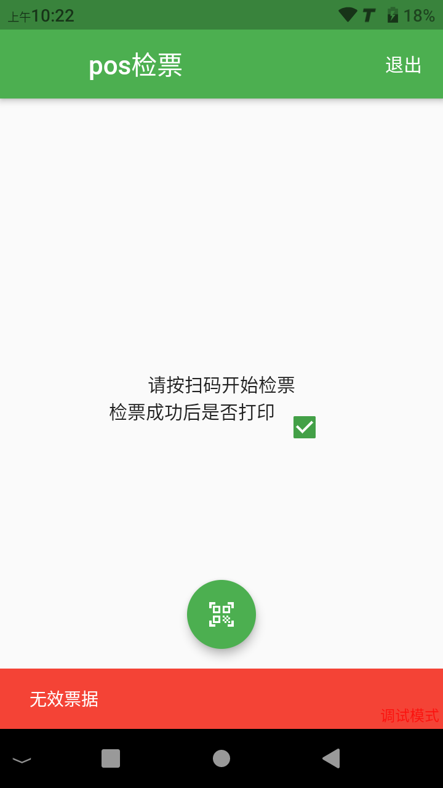
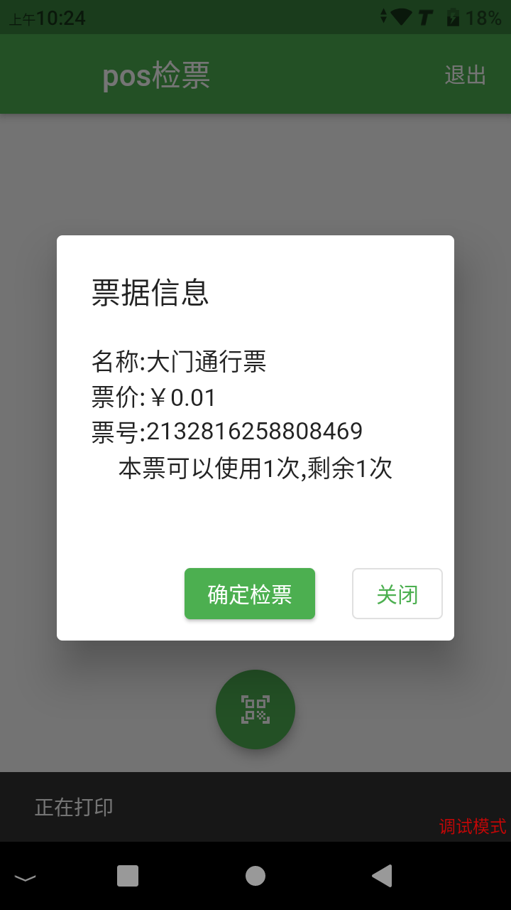

# 手持检票机

>除了通道闸机检票方式，[智慧票务系统](https://www.zl771.cn)还支持手持机检票

## 后台创建检票员账号

如果进出都需要检票，那么就需要创建两个检票设备，一个入一个出。大多数情况下，我们只需要创建“入”的检票设备。

> 检票设备只能检验设定的门票，所以必须设置“可检门票”。

## 手持机登录检票

在登录之前需要先设置服务器地址，在登录页面点击右上角的齿轮按钮，弹出的窗口中输入服务器的URL

使用后台创建的账号密码登录POS机

登录之后就可以开始检票了，可以根据实际情况来设置是否打印小票

