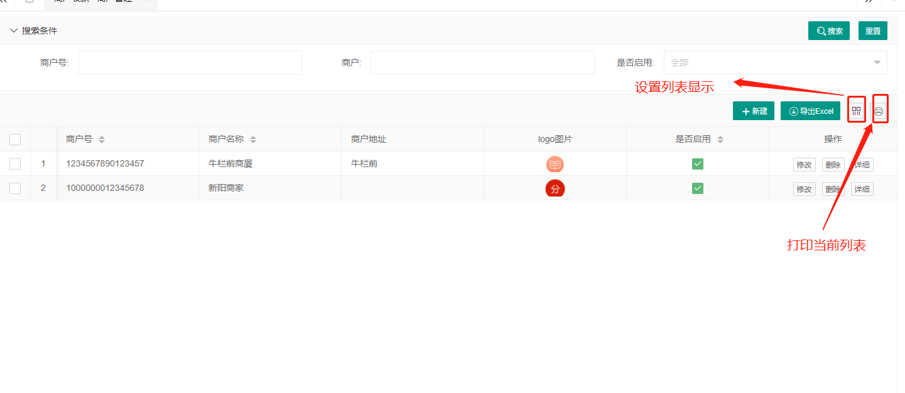
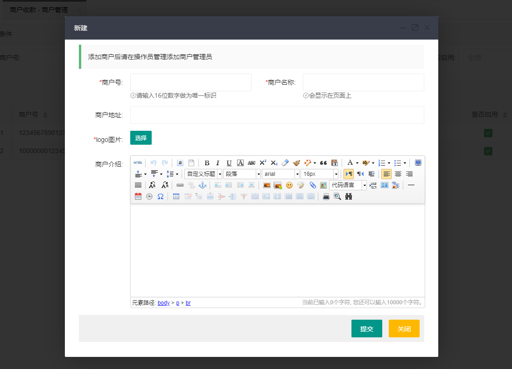
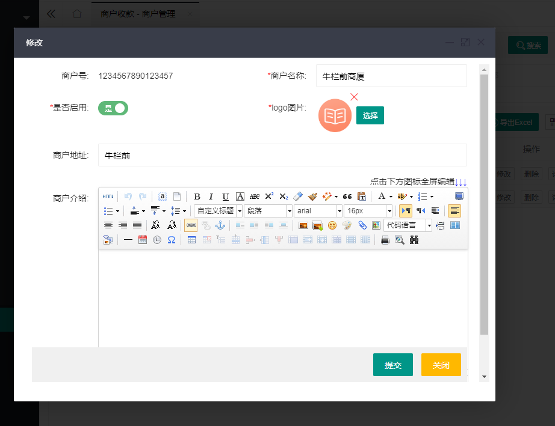
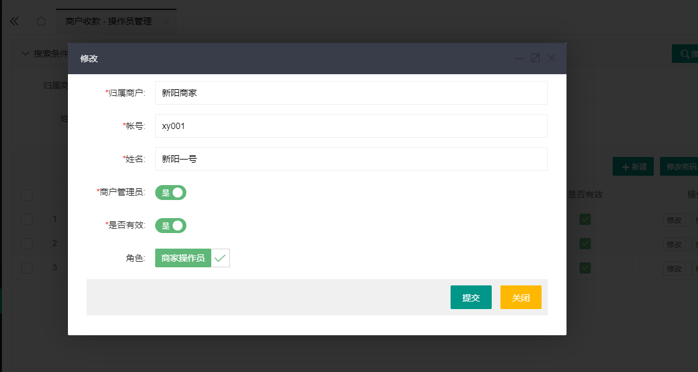
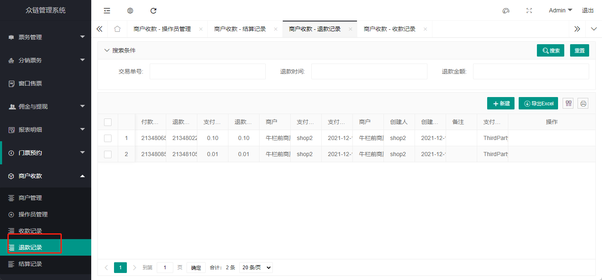
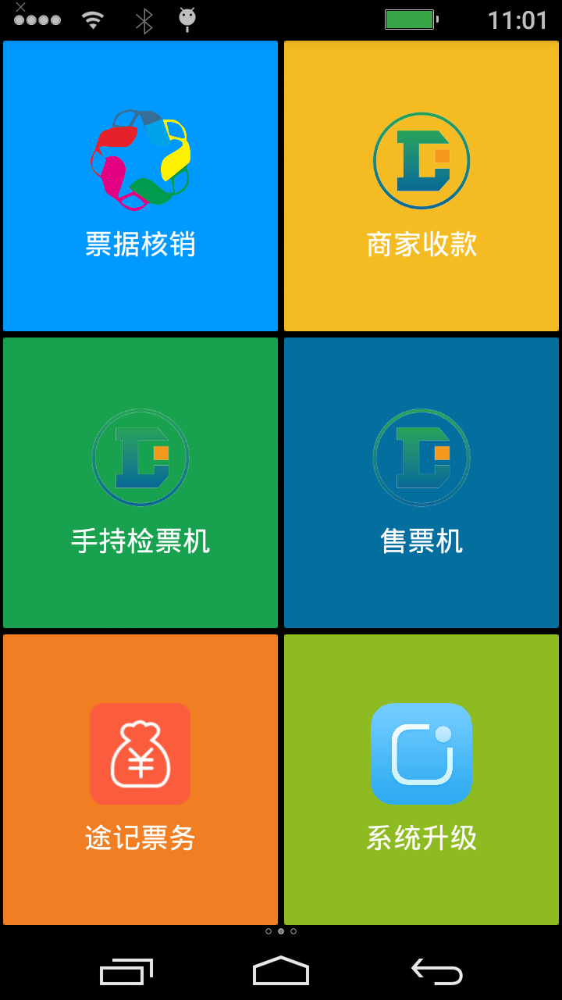

# 商家pos机

> [智慧票务系统](https://www.zl771.cn)商家可以通过pos机直接向用户收款，特别适合那些直接收费入场的场景。
pos机在使用之前先在后台创建好商户和操作员
**警告：在使用商家POS收款功能之前请先阅读本篇文章**

## 1 后台设置

### 商户管理

在左侧导航菜单中找到"商户收款",点击"商户管理"进入商户管理页面。商户的搜索查询、创建修改、启动停用和删除都在这个页面上操作。

* 搜索商户
  > 输入搜索条件点击搜索即可搜索商户，点击重置可以清除搜索条件

  

* 导出商户列表
  > 点击导出Excel可以导出所有满足搜索条件的商户。

  

* 新建商户
  > 点击页面上的新建按钮，在弹出的对话框中输入商户的信息，然后点击提交即可创建商户。
  **提示：** 商户号在系统中不可重复，而且商户号一旦创建了就不可以修改。

  

* 编辑商户信息
  
  > 可以再编辑商户信息的页面 修改商户名称、logo、介绍、启用/停用商户，但是商户号是不能修改的。

  

### 操作员管理

  >**提示：**商户创建后还必须要有操作员才能正常使用,在创建操作员之前要先创建好商家操作员的角色，创建操作员角色的步骤参见[后台操作说明书](guide/backend.md)，在此不作赘述。 创建的操作员角色编号必须是以“9900”开头
  >
  >

* 操作员管理主页面
  操作员不可以删除，如果不在使用，禁用即可。
  

* 创建操作员
  >点击新建按钮，在弹出的对话框中录入操作员的账号密码和姓名，设置操作员角色和归属商户，然后点提交即可。

  

* 修改操作员
  >点击修改按钮，在弹出的对话框可以修改操作员的信息。如果要修改密码，则要点击“修改密码” 来修改。

  

### 收款记录

  >收款记录可以查看和导出，不可编辑修改。

  

### 退款记录

  >操作退款可以在手持机上也可以在后台进行。

  

* 退款
  > 在退款记录页面添加“新建”打开退款页面，输入交易单号、退款金额 点击提交即可退款
  > **退款的金额不能大于支付金额,退款只能退当天的交易**
  
  

### 结算记录

  >系统每天凌晨会自动生成前一天的交易结算单，生成的结算单经过财务确认后，可以再点击“确认操作”

  

## 2 手持POS机

### 安装pos App

目前app 适配了 N86、P1000和P2000手持机，其他的POS机如有需要接入，需要做定制开发。在未适配的设备上即使强制安装上了APP，也无法正常使用。
**APP安装包请联系工作人员获取！**

### 设置APP的服务器地址

* 打开app 在登录页面的点击右上角的齿轮图标打开设置对话框
* 输入服务器的url地址，注意末尾不要“/”

### 使用POS收款

* 输入后台设置的账号密码登录手持机

 

