# 自助售票机


**Good to know:** [智慧票务系统](https://www.zl771.cn)自助售票机是票务系统中一个重要的门票销售渠道，通过自助机可用节省大量人力成本，目前自助机支持扫码支付、支持刷身份证购票。


## 设置自助机的服务器地址

> 自助机在使用之前先设置服务器地址，否则将无法正常售票

### 进入设置页面

* 在自助机首页点击“管理/设置页面”
  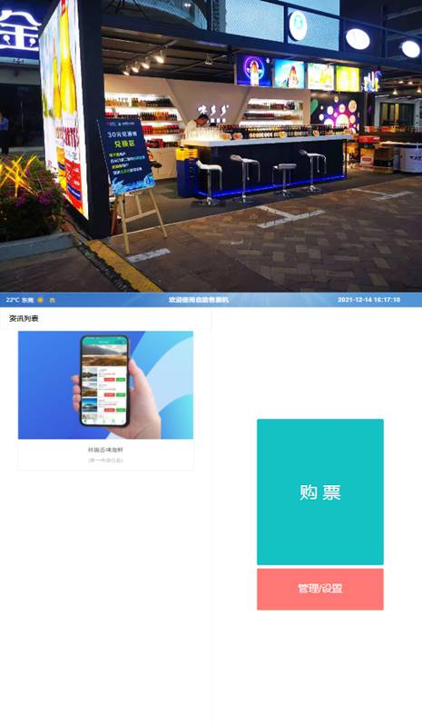

* 输入管理密码“82112711”
   
   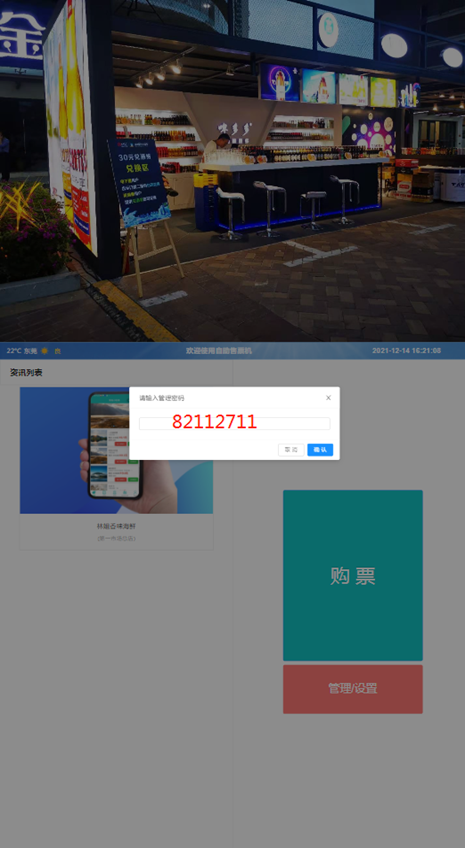

* 设置IP地址
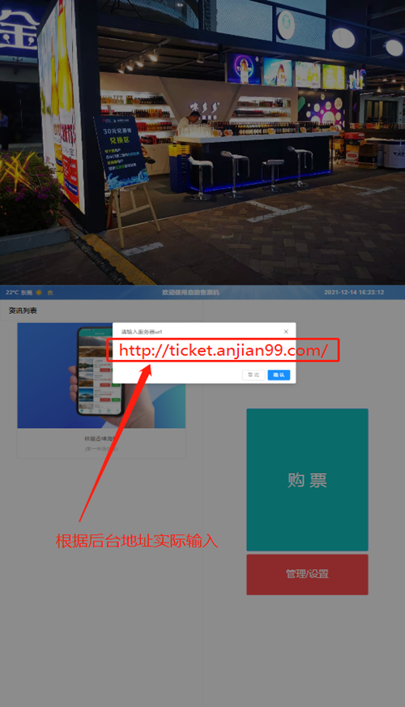

## 后台设置自助机参数

### 基础参数设置

打开后台管理页面

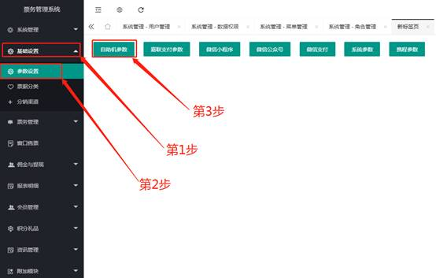
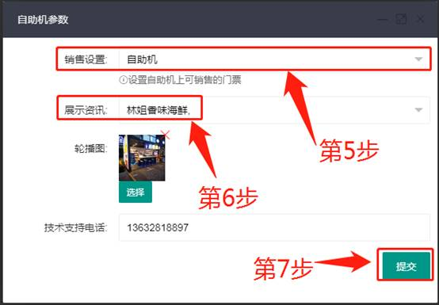

### 自助机销售设置

>选择自助机售票（自助机可售哪种票？）
票务管理：售票设置：自助机（修改）

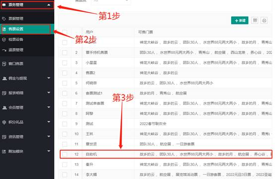
选择可售门票
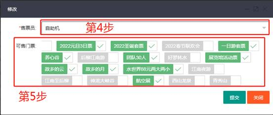

### 自助机上的资讯设置

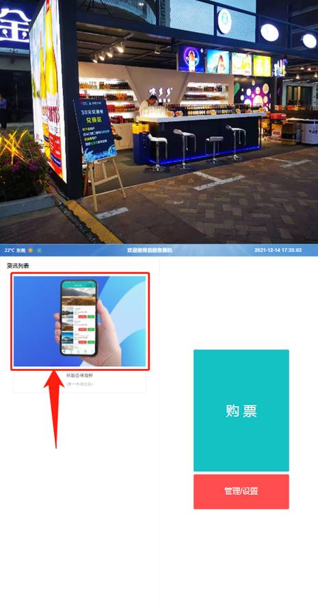

>后台电脑操作
1.咨询管理：2.文章管理：3.新建

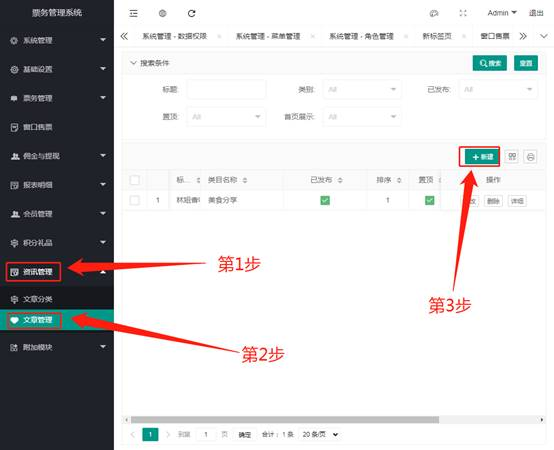

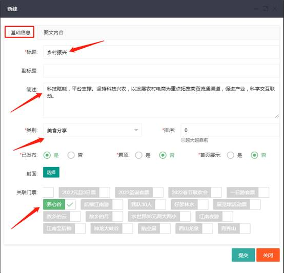

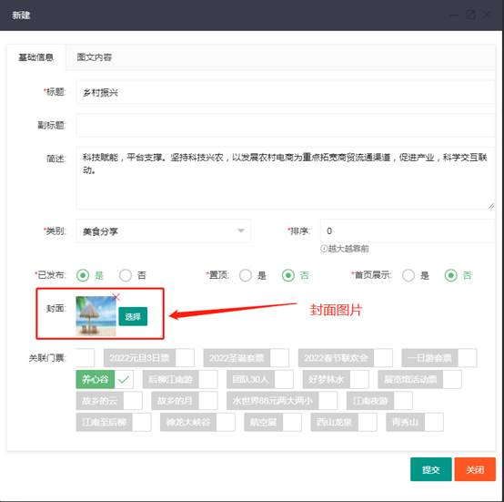

图文内容
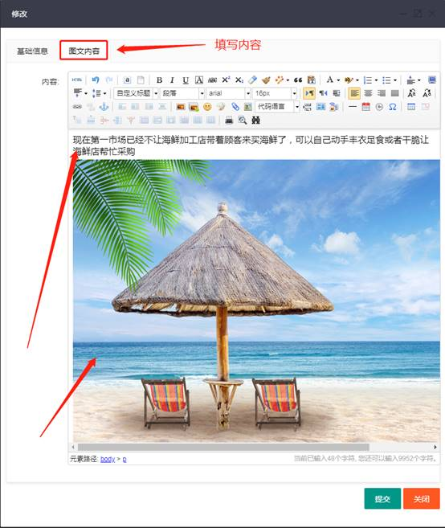
以上步骤完成之后：查看是否顶置
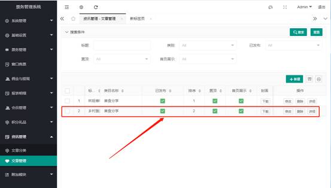
参数设置：自助机参数
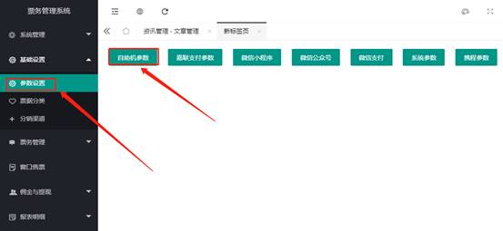
展示资讯：选择新的图片展示

选择图片
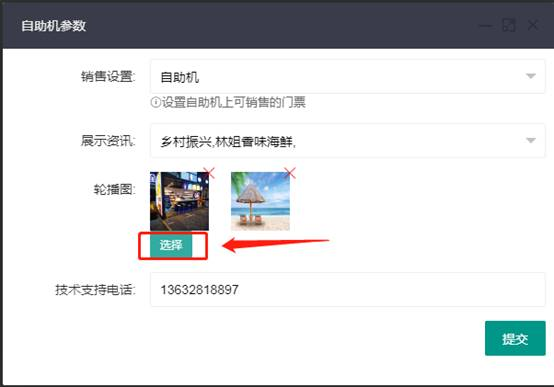
最后提交保存成功
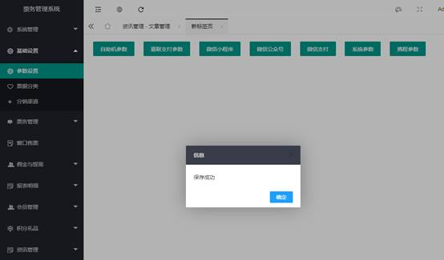
自助展示的结果
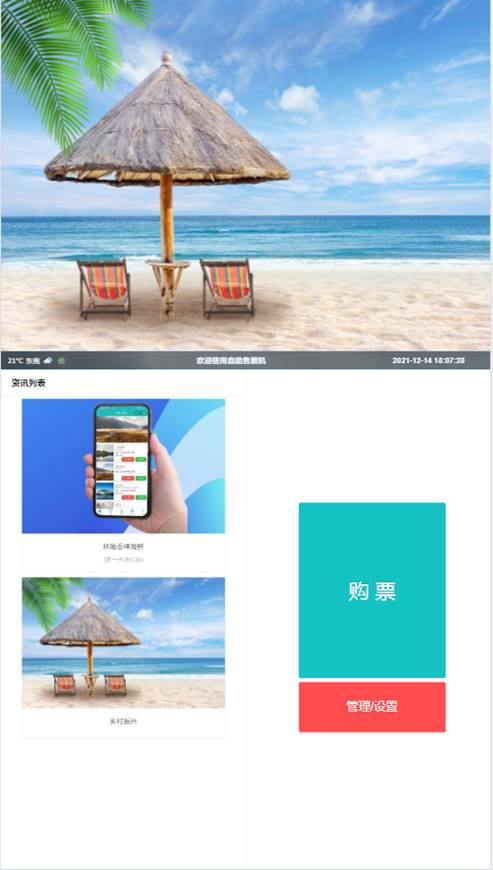

### 自助机上打印机设置

#### **励能打印机**

设备打印机：
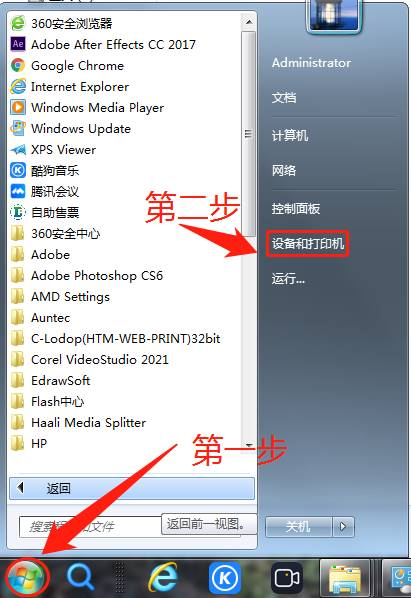
找到打印机服务器属性
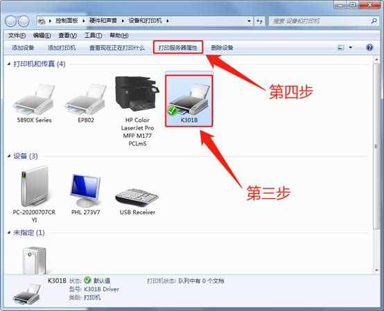
创建打印机规格
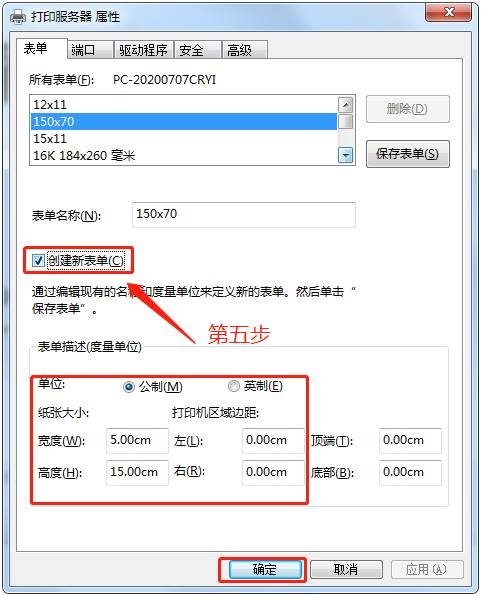
打印机首选项
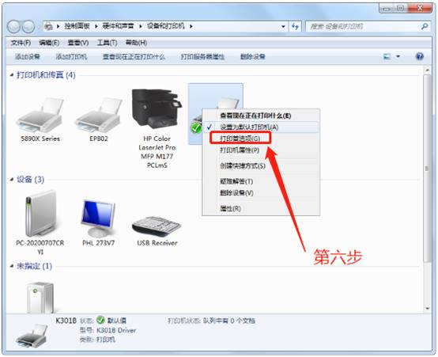
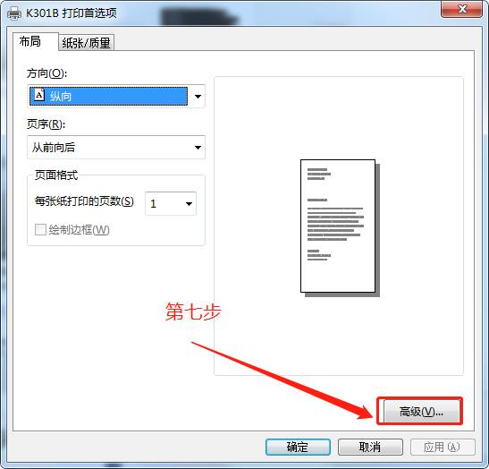
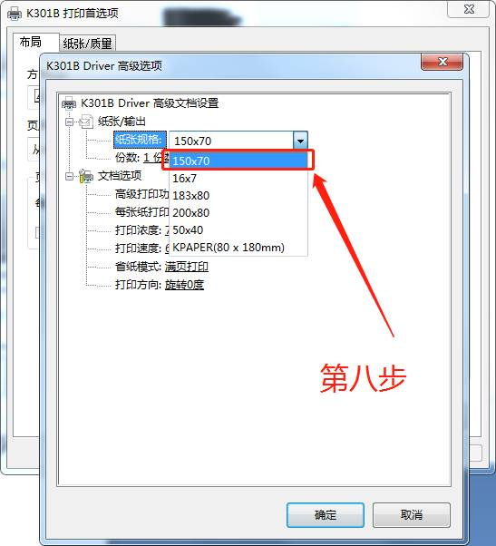
打印机属性

设备设置
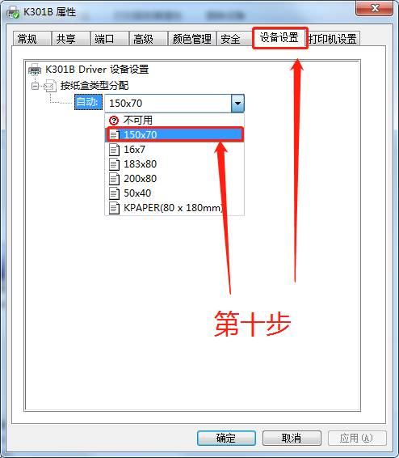
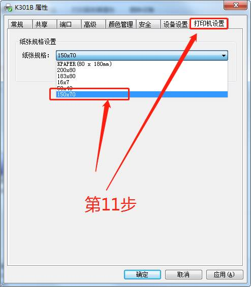
检查结果

