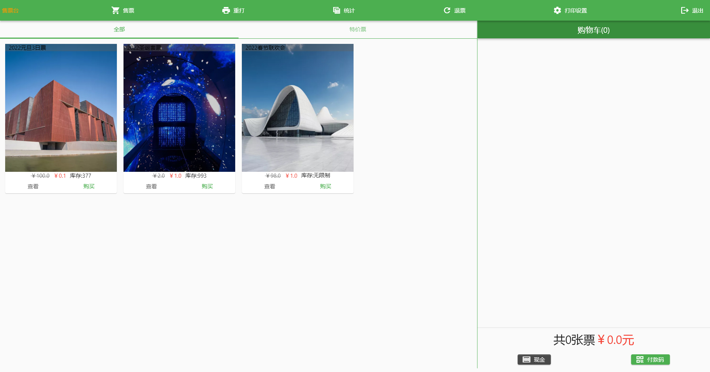

# 窗口售票

[智慧票务系统](https://www.zl771.cn)窗口售票端的功能与手持售票机的功能大体相同，只是界面上的操作和打印功能有些差异，这里不做赘述。[点击这里](guide/pos-saler.md)可以查看手持售票机的说明文档，[点击这里](others/printsetting.md)查看打印机设置说明

目前窗口售票机程序支持Windows和Android两种系统。

