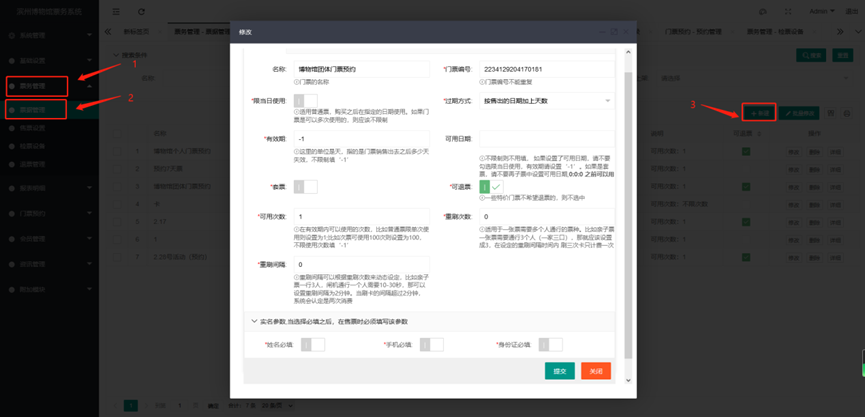
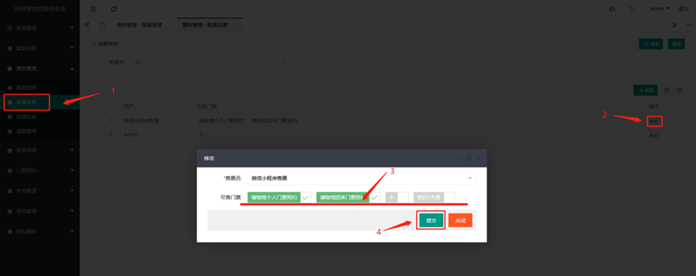

# 最新版预约系统操作手册

## 登录系统

## 系统管理-日志查看（所有在操作系统上操作留下的记录)

## 用户管理

1. 打开系统管理
2. 打开用户管理
3. 点击新建

    >1. 账号：登录系统的账号（英文、数字、符号）
    >2. 密码：设置密码
    >3. 姓名：该账号使用者的名字
    >4. 角色：这个账号授权他是什么角色
    >5. 用户组：这个账号所在的用户组是什么

4. 编辑完成之后提交

## 角色管理

>角色管理：角色管理就是这个用户分到这个角色，在这个角色设置了可见页面以及操作权限，通过这个用户登录到系统上，该用户就能看到你给他授权显示的页面以及可操作的权限功能。

1. 打开系统管理
2. 打开角色管理
3. 新建

    >1. 角色编号：可以随便编号但是不能重复（数字、英文、符号），只是做记录使用；
    >2. 角色名称：这个新建角色的名称是什么？（如可以操作团体预约相关的，可命名为：团体预约）；
    >3. 备注：对这个新建角色的备注，说明等等、

4. 设置角色的页面权限
    

    >1. 找到对应的角色  - 页面权限；这个是设置该角色在系统登录后可以看见的页面以及可进行的操作；勾选上就可见可操作；没有勾选上就不可见也不可以操作
    >2. 编辑完成 提交

## 用户组管理

### 创建用户组

>1. 用户组编号：编号设置，做标记功能；
>2. 组名：新建的这个组的名称是什么？
>3. 备注：这个组的特殊备注；
>4. 提交；

### 用户组数据权限设置

**找到对应组-点击数据权限**

>1. 门票分销商：预约系统使用不到该功能，可以放宽，没有其他影响
>2. 售票人员：需要设置全部权限，是售票使用及查看数据使用
>3. 检票设备：需要设置全部权限，查看检票数据需要使用
>2、提交

### 设置用户的用户组

## 菜单管理设置

>菜单管理是对左边菜单栏的设置，我们已经全部设置好了就可以不用动了，如不知道如何设置可以与客服联系，让我们的客服指导操作
**修改完后要刷新菜单，重新登录后生效**

## 数据权限管理

>数据权限：数据权限是对应的数据，有分销商的数据、检票的数据、售票员的数据，设置了有权限之后才可以看到相应的数据

1. 点击左侧菜单-系统管理；
2. 点击左侧菜单-数据权限；
3. 点击新建；

    >1. 权限类别：一般设置用户组权限，
    >2. 权限名称：名称是什么；（例如平台管理员  需要查看所有数据权限，就给他设置所有权限）；
    >3. 全部权限：是/否；
    >4. 用户组：选择用户组进行授权；

4. 提交；

## 个人预约门票新建

1. 新建个人预约票据
    1. 基础参数
        
        1. 名称：门票的名称（个人预约票的名称.
        2. 门票编号：每一个票的编号是不一样的
        3. 限当日使用：门票预约不适用这个功能
        4. 过期方式：门票预约不适用这个功能
        5. 有效期：有效期可以根据票据的使用时间而定，不做限制，放宽权限；填写 -1
        6. 可用范围：门票预约不适用这个功能
        7. 套票：门票预约不适用这个功能
        8. 可退票：勾选之后预约的门票可以退
        9. 可用次数：预约门票是一人一票制，填写的次数为 1
        10. 重刷次数：门票预约不适用这个功能
        11. 重刷间隔：门票预约不适用这个功能
        12. 实名制：门票预约不适用这个功能(因为预约填写信息哪里已经有这些窗口了不用勾选).
    2. 销售参数
        
        1. 售价：门票免费预约不适用这个功能
        2. 原价：门票免费预约不适用这个功能
        3. 库存：库存与预约管理的场次都有限制所以这个库存不做限制，填写 -1
        4. 用户限购：填入0不限制单个用户的购买数量,这个限制只有在小程序购票上才会生效。会直接限制会员的购买数量，这里需要限制会员预约人数，一个微信号只能预约一个门票；这里填写 1
        5. 佣金：门票预约不适用这个功能
        6. 赠送积分：门票预约不适用这个功能
    3. 前端设置
        
        1. 分类：在自助机或者窗口售票机上显示的分类
        2. 排序：前端显示的排序
        3. 上架：勾选后才可以在前端预约
        4. 轮播显示：在小程序上轮播显示
        5. 电话：在门票页面显示，方便游客联系
        6. 地址：在门票页面显示，方便游客导航
    4. 图文介绍
        
        >这个是显示门票预约详情和须知，文本需要在这里编辑
        1. 海报底图：600*800
        2. 相册：600*450
        3. 介绍：尽量不使用空格，实在不行可以使用图片式的；
        4. 编辑好之后点击 提交

### 2. 授权售票

  

  1. 打开售票设置；
  2. 打开修改(对应的售票员：微信小程序售票)；
  3. 编辑可以出售的个人票（需要将新建的个人票勾选上）；
  4. 编辑好之后提交；

### 3. 检票设置

  

  1. 点击检票设置；
  2. 找到一楼闸机入口；
  3. 点击修改；
  4. 编辑可检门票（将新建的个人票勾选上）；
  5. 编辑好之后 提交；

### 4. 新建可预约时间

  1. 门票预约；
  2. 预约管理；
  3. 新建
      1. 开始日期：可以预约的时间；
      2. 截止日期：截止预约的时间；
      3. 可以提前几天开始预约：（可提前预约的天数,比如10月1日的票在9月20日可以预约，则填入11. ；
      4. 场次：上午场：开始检票时间（8：00. 截止时间（12：00. 时间可以自行设置下午场：开始检票时间（13：00. 截止时间（16：00. 时间可以自行设置,预约票只能在规定的时间里进行检票，其他时间检票无效，通道闸机不会开门
      5. 场次数量：可预约的人数为多少人就填多少，50人则填50 ；
      6. 关联门票：勾选单人预约门票；

  4. 提交；

## 团体预约门票

### 一、新建团体票据

> 步骤与个人票类似，这里不再做赘述

### 二、 隐藏团体票（不让团体票在小程序上显示出来）

  >页面上的其他参数设置没有使用到不做修改；隐藏门票是防止散客看到之后预约了团体，导致团体的人员预约票不够。

  

  1. 打开基础设置
  2. 打开参数设置
  3. 打开微信小程序
  4. 选择需要隐藏的门票，
  5. 勾选上
  6. 编辑好之后提交.

### 三、授权售票

  > 步骤与个人票类似，这里不再做赘述

### 四、检票设置

  > 步骤与个人票类似，这里不再做赘述

### 五、新建可预约时间

  > 步骤与个人票类似，这里不再做赘述

### 六、团体预约码获取与分享

  

  1. 找到票务管理；
  2. 打开票据管理；
  3. 点击对应的微信推广码；
  4. 保存二维码分享给游客团体；

## 小程序首页设置

  

  1. 附加模块
  2. 小程序模板
  3. 编辑；
  4. 上传图片；尺寸：750*400
  5. 更新页面；
  6. 提交发布；


**其他设置:** 其他设置与标准版的票务系统手册类似，请参考票务系统的后台手册


## 小程序上个人预约流程

