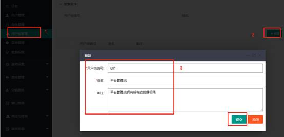
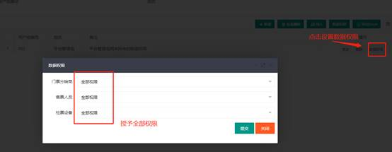
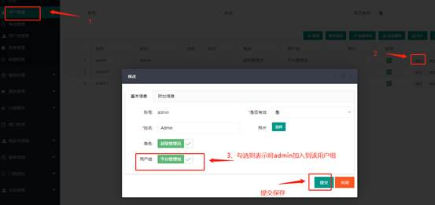
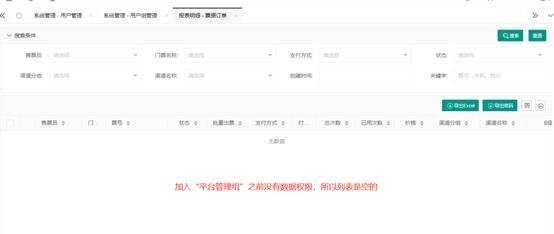
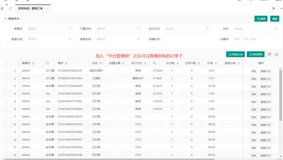
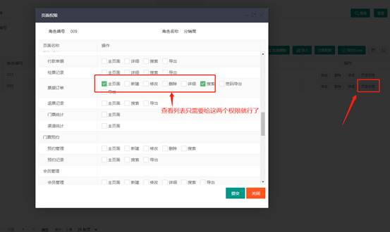
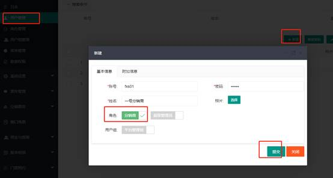
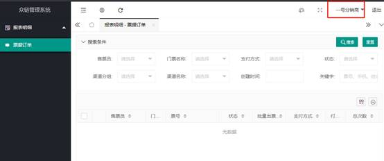
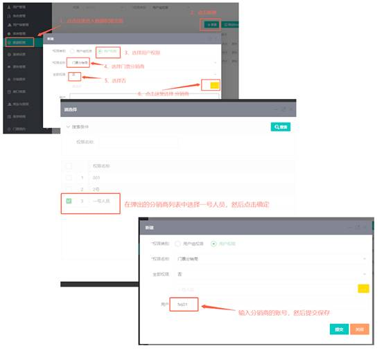
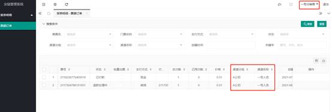

#  数据权限设置教程

>[众链网络-票务系统](https://www.zl771.cn)数据权限，顾名思义就是对系统中数据的访问权限。比如销售组长可以查看小组成员内每个人的销售情况，而每个组员只能查看自己的销售情况。再比如有系统管理员可以查看各个区域的检票记录，而各个区域的负责人只能查看自己区域的检票记录。

目前[众链网络-票务系统](https://www.zl771.cn)支持3个数据权限点，分别是门票分销商、售票人员、检票设备，这三个数据权限点中，门票分销商和售票人员作用于“票据订单”,检票设备作用于“检票记录”。这意味着平台管理员要想查看所有的“票据订单”和所有的“检票记录”必须要先给平台用户组所有的数据权限。
下面我们就演示一下 如何设置数据权限

## 设置数据权限

### 让平台管理人员拥有所有的数据权限

1. 首先，我们先创建一个平台管理组，然后把所有的平台工作人员都拉入该用户组。
 
2. 创建好平台管理用户组后，设置数据权限
 

3. 将用户加入到用户组
 

4. 可以对比一下，下面两张图一张是在加入“平台管理组”之前，一张是加入“平台管理组”之后的，可以看到在加入用户组之前页面上是没有任何数据显示的，加入用户组之后则可以查看到所有的数据
  

5. 值得注意的是， 用户加入或退出用户组后，必须重新登录其数据权限才会生效。

### 设置分销商只能查看自己的票据订单

1. 创建分销商角色，并设置好页面权限，如果已经有了分销商角色则可以跳过此步骤。
 
 保存后点击页面权限按钮，设置分销商这个角色的权限，由于我们只给分销商查看票据订单，所以我们只勾上票据订单就行了。
 

2. 新建一个分销商的账号，并设置好角色
 
3. 创建好之后，我们用新建的分销商账户登录系统
 
 此时虽然我们有权限登录系统并打开相应的页面，但是因为这个页面是有控制数据权限的，所以看不到任何数据的。

4. 设置分销商账户的数据权限，使用超级管理员登录系统，在数据权限页面中给“一号分销商”设置数据权限
 

5. 设置好之后我们在登录分销商的账号，此时看到票据订单列表中已经有数据量，并且只有一号人员这个分销商的数据。
 

>以上就是门票分销商数据权限的使用介绍 ，售票人员和检票设备的设置方式也类似，由于篇幅有限，在此就不作赘述。祝您使用愉。
