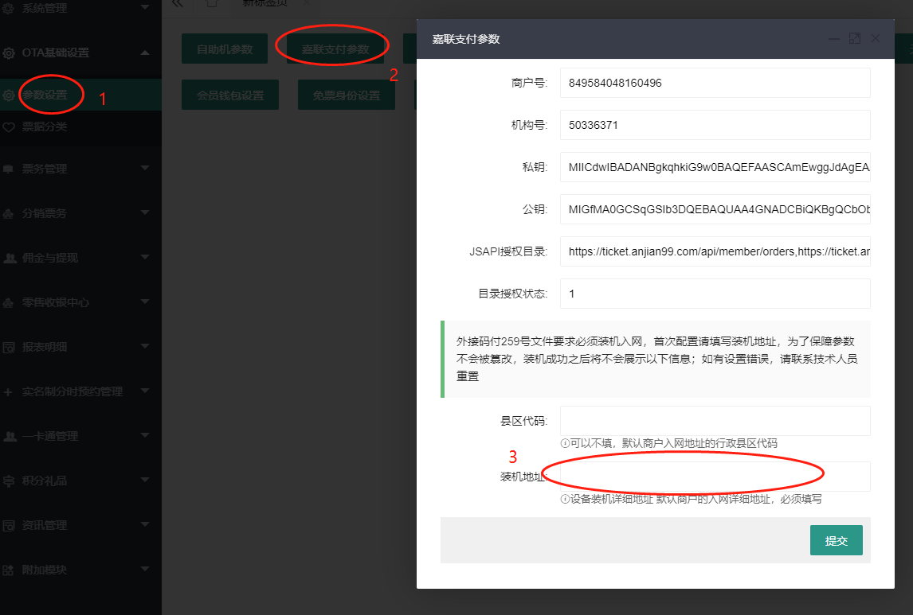

# 嘉联接口升级教程

>我公司已于2022年09月15日向各合作机构发布259号文相关终端报备及交易上送技术规范指引，请机构参照规范指引尽快完成系统改造，支持报文上送终端号信息、IP地址或经纬度信息。
外接码付259号改造技术规范指引文档：<https://jlpay.yuque.com/docs/share/8f18b673-b203-48c8-932e-021fc64dd6f4?#>
4、 对于逾期未完成改造的终端，我公司将按监管要求采取暂停提供转接支付服务等必要措施，由此产生的后果由贵司自行承担。

## 程序已经更新，请按以下步骤进行接口升级，升级接口成功后请做一笔交易测试

