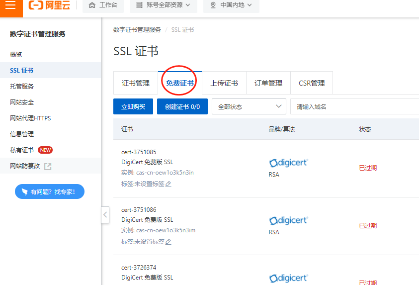

# 前期准备工作

## 申请公众号小程序

[众链网络-票务系统](https://www.zl771.cn)线上通过小程序来售票，所以我们要先开通公众号小程序。微信小程序可以通过复用公众号的认证资料来快速开通，一个公众号可以开通多个小程序，所以我们只要认证公众号就可以了。如果已有公众号可以直接开通小程序

+ 首先，打开[微信公众平台网站<https://mp.weixin.qq.com>](https://mp.weixin.qq.com),点击立即注册进入注册页面

+ 选择注册账号类型为服务号

按照页面的提示注册号服务号后，提交认证，认证费300元，一般审核会在一周内通过

## 开通支付通道

目前我们的系统支持微信原生支付和嘉联支付，嘉联支付可以支持银联、微信、支付宝，费率更低，开通方式请与我们的工作人员联系。

### 购买云服务器和域名

>如果您不想购买服务器，也可以把系统托管在我们提供的服务器上。我们可免费提供二级域名

[推荐使用阿里云服务器 https://www.aliyun.com 点击打开链接](https://www.aliyun.com/daily-act/ecs/fy22-12-yure?userCode=n2h0vqr9) 根据项目的实际情况选择购买的服务器数量和配置

小型项目使用单台服务器即可，流量、用户量比较大的建议使用2台以上，数据库和程序分开部署。当然，我们的系统也是支持集群部署的，您可以根据自己的实际情况来确定是否需要集群部署。

#### 购买域名

>域名注册好实名认证通过后需要备案，备案周期每个地方不一样，一般在20个工作日内完成。注册好域名后可以打开阿里云的备案<https://beian.aliyun.com/>提交网站备案

小程序必须使用备案好的域名且使用SSL才能够正常访问，阿里云提供免费的SSL证书,使用免费的SSL证书即可满足小程序的要求

#### 使用CDN加速系统的访问

一般的，为了节约服务器的开支成本，服务器可以选择较小的网络带宽，通过CDN提高系统的访问速度。进入阿里云的CDN工作台创建好域名的CDN即可<https://cdn.console.aliyun.com/>

### 开通短信（可选）

如果您需要在用户购票之后发送短信通知，那就需要开通阿里云短信。

以上工作准备好之后就可以部署安装系统了。