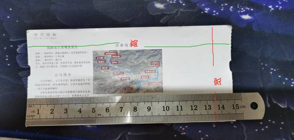
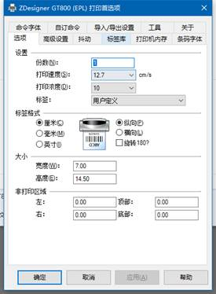
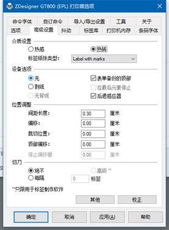
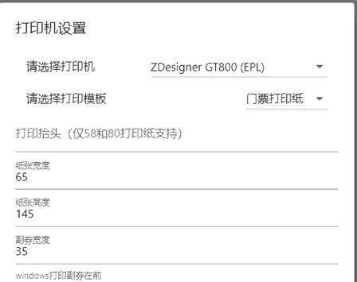
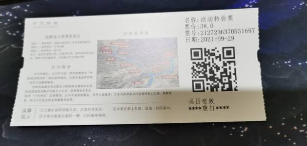

# 售票机打印设置  

售票机有安卓机和windows机，两种系统的设置大同小异，这里就拿windows来解说

## windows

>58打印机和80打印机不用设置副券， 纸张宽为40或70，高度根据实际情况设置一般设置100

* 测量门票打印纸的宽高

* Windows 下设置的宽高要比实际的纸张小，副券宽度表示的是打印的区域宽度，一般是30-40

* 斑马打印机设置

* 打开窗口售票机系统，在系统里设置的参数如下

* 打印效果

