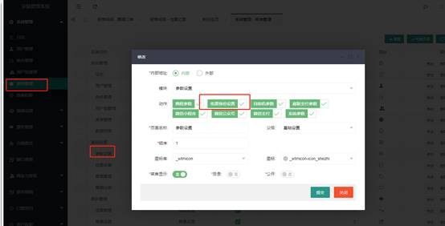
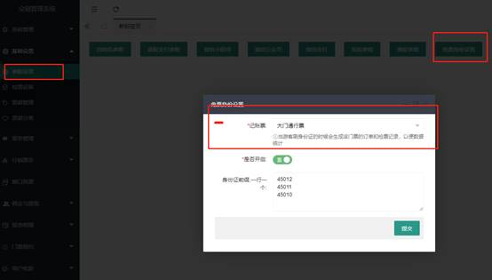
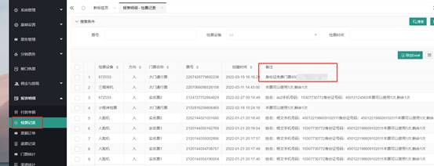
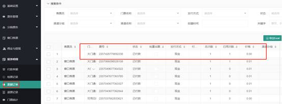
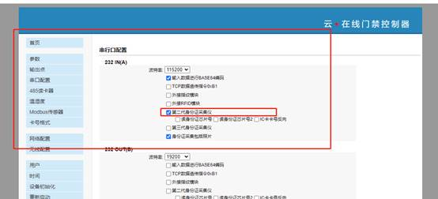

# 市民刷身份证免门票的设置

> 现在很多景区都针对当地游客执行免费入园的政策，众链智慧票务系统现在也支持市民刷身份证免费入园的功能了！在后台可以设置是否开启这个功能，默认是关闭的。

## 1设置权限

## 2，参数配置

## 3、在闸机上直接刷身份证即可通行，如果当日已使用过，会提示“今日已使用”，同行后在检票记录中会看到免费通行的记录，在票据订单中也会有一条0元的门票

 

## 闸机上读身份证的设置

