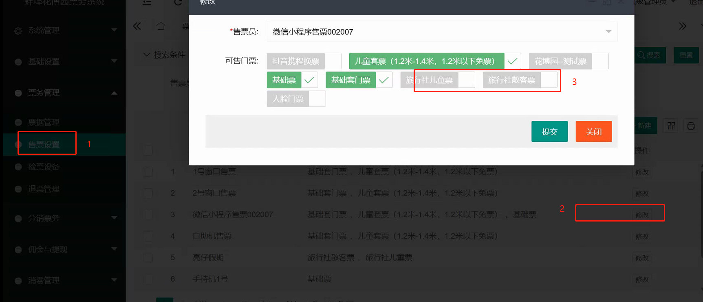
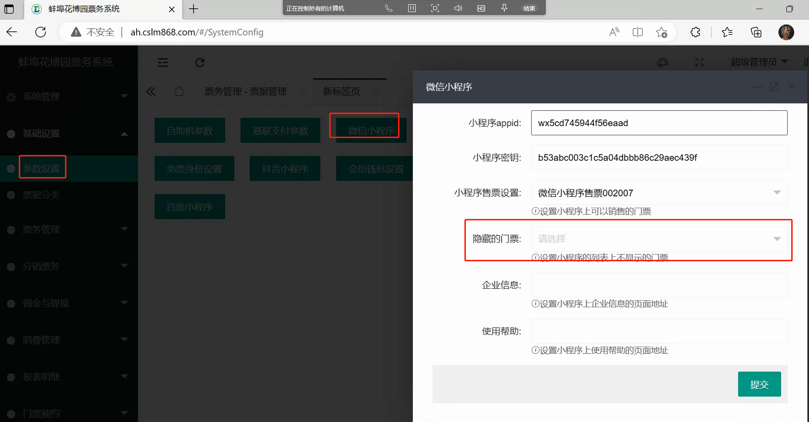

# 如何在小程序上隐藏门票

> 有时候我们希望门票可以在小程序上购买，但是门票不在列表中展示出来。比如渠道分销的时候，系统给每个渠道都设定了专属的门票，这个门票的价格比正常的价格要低很多，渠道人员拿到门票的二维码之后给用户扫码下单购买。如果小程序上不设置隐藏的话，那任何人进入小程序都可以购买渠道门票，显然这是不合适的。

## 设置步骤

1. 上架门票，并设置可以在小程序上销售
2. 在系统设置/微信小程序下
3. 这样设置之后用户正常进入小程序就看不到门票了，后台管理员把门票的小程序码发给分销商，分销商再给用户扫码用户就可以看到并购买该门票
